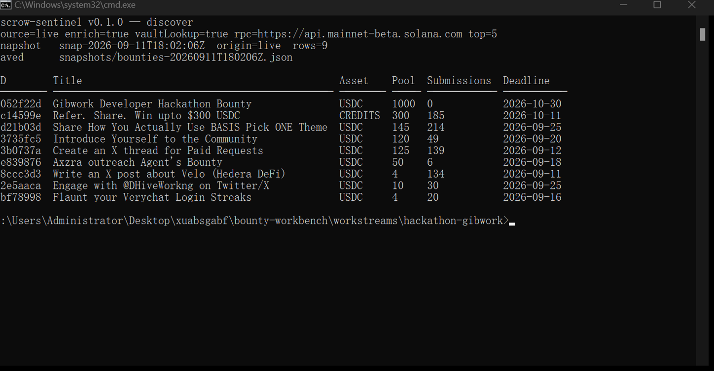
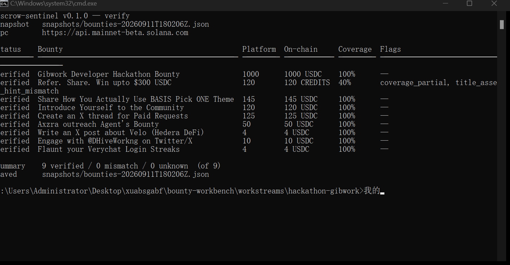
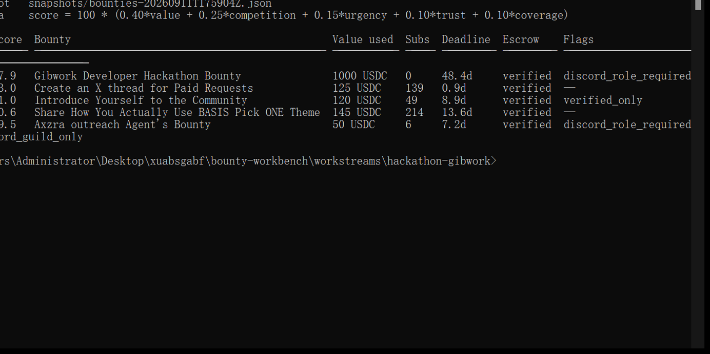
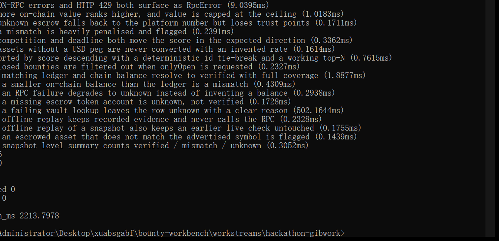

# Escrow Sentinel

**Repo:** <https://github.com/summerlx0416-droid/escrow-sentinel> - MIT licensed, TypeScript, Node >= 22, no wallet or API key required.

**A read-only Gibwork bounty radar for developers and AI agents: discover open
bounties, verify their Solana escrow on-chain, rank them by value / competition /
deadline, diff captures over time and export Markdown + CSV + JSON reports —
from the terminal, over MCP, without a wallet.**

Bounty use case: *Gibwork Developer Hackathon Bounty* (1000 USDC escrow) —
"create a new non-web-app use case for Gibwork using the SDK, CLI, or MCP".

---

## Use case

Bounty boards show you a headline number. They do not show you whether that money
is still in the escrow account, whether the asset is what the title claims, or how
many people are already competing for it. On Gibwork that gap is visible in the
live data today:

- `Refer. Share. Win upto $300 USDC` — the listing asset is **CREDITS**, not
  USDC, and the escrow account holds **120** against an advertised pool of 300
  (40% coverage). The title says 300, the chain says 120.
- Several USDC pools have already been partly withdrawn; the "pool" number in the
  listing is the amount still advertised, not necessarily what is escrowed.
- Submission counts move every few hours and are invisible in a static listing.

Escrow Sentinel is a CLI + MCP server that closes that gap for anyone doing
bounty triage: freelance developers, DAO ops, grant reviewers and — the part this
bounty asks for — **AI agents that are about to recommend work to a human**.

It is deliberately *not* a web app, dashboard or browser product: everything runs
in a terminal or as an MCP stdio server inside Claude Code / Codex / Cursor.

### Why it is valuable

1. **It checks the money, not the marketing.** Every bounty's escrow token account
   is read directly from Solana (`getAccountInfo` jsonParsed +
   `getTokenAccountBalance`) and compared with the platform ledger. The result is
   `verified`, `mismatch` or `unknown` — never a guess.
2. **It scores the opportunity.** Value is chain-first, competition comes from the
   bounty's own submission metrics, and deadline urgency is part of the score. The
   formula is in this README and in `src/lib/score.ts`.
3. **It remembers.** Each run saves a UTC-stamped snapshot; `diff` reports new
   bounties, expired bounties, escrow balance moves and submission-count changes.
   Run it from cron and you have a bounty radar.
4. **It is agent-ready.** A read-only MCP server exposes all of the above as four
   tools, so an assistant can answer "which Gibwork bounties have verified escrow
   and low competition?" with data instead of vibes.
5. **It exports artifacts.** Every `report` run writes `report.md`, `report.csv`,
   `report.json`, the full `snapshot.json` and `diff.md` into
   `reports/<UTC-stamp>/`.

### Which Gibwork toolset is used

**MCP.** The core integration of this project is an MCP server: Escrow Sentinel
speaks MCP over stdio and exposes four read-only tools
(`gib_list_bounties`, `gib_verify_escrow`, `gib_snapshot_diff`, `gib_report`) to
any MCP client, so Gibwork bounty data becomes usable inside agent workflows.

It is designed as the **read-only companion to the official `@gibwork/mcp`
server**: the official server covers the authenticated, wallet-backed path
(`gibwork_task_list`, `gibwork_task_available`, submission prepare/submit,
payments — 18 tools that need a local Solana keypair and can be registered with
`--read-only` for browsing). Escrow Sentinel covers the layer the official server
does not expose: *is the escrow real, is the advertised asset the escrowed asset,
how much of the pool remains, how crowded is the bounty, what changed since the
last capture*. Register both servers next to each other and the agent gets the
full picture: Sentinel for analysis, the official server for actions.

Discovery itself uses the same public read surface the Gibwork web app calls
(`api.gib.work/explore`, the public vault query and the bounty detail page), which
is why Escrow Sentinel keeps working with no wallet, no key and no account — and
why it can be replayed fully offline from the committed fixture.

---

## Quick start

Requires **Node.js >= 22** (developed and verified on Node 24.18.0).

```sh
npm i            # installs the two dev dependencies (TypeScript + @types/node)
npm run build    # compiles src/ -> dist/
node --test      # 46 tests, no network required
```

Run it:

```sh
node dist/cli.js discover            # fetch the public listing, save a snapshot
node dist/cli.js verify              # check every escrow account on Solana
node dist/cli.js rank --top 5        # score and rank
node dist/cli.js diff                # compare with the previous capture
node dist/cli.js report              # discover + verify + rank + diff -> reports/<UTC>/
node dist/cli.js mcp                 # start the read-only MCP stdio server
node dist/cli.js tools               # print the MCP server card as JSON
node dist/cli.js help                # full flag reference
```

Offline / deterministic modes (no network at all):

```sh
node dist/cli.js discover --source fixture --offline
node dist/cli.js verify --offline      # replays the verification stored in the snapshot
node dist/cli.js rank --offline --top 5
node dist/cli.js report --offline      # writes a complete report from the fixture
```

`--offline` never opens a socket: the listing comes from the committed fixture and
each row is replayed with the verification it already carries (labelled `recorded`
or `live` with its original timestamp). Rows that were never checked stay
`unknown`.

### Environment variables

Everything is optional (see `.env.example`); CLI flags win over env vars.

| Variable | Default | Purpose |
| --- | --- | --- |
| `SOLANA_RPC_URL` | `https://api.mainnet-beta.solana.com` | RPC endpoint for escrow reads |
| `GIB_EXPLORE_URL` | `https://api.gib.work/explore?page=1` | public listing endpoint |
| `GIB_VAULTS_URL` | `https://api.gib.work/vaults` | public escrow/vault query |
| `GIB_DETAIL_URL_TEMPLATE` | `https://gib.work/bounty/{id}` | detail page (submission counts, gating) |
| `ESCROW_SENTINEL_SOURCE` | `auto` | `auto` \| `live` \| `fixture` |
| `ESCROW_SENTINEL_OFFLINE` | `0` | `1` = no network at all: fixture + stored verifications |
| `ESCROW_SENTINEL_ENRICH` | `1` | fetch detail pages for submission counts |
| `ESCROW_SENTINEL_VAULT_LOOKUP` | `1` | resolve escrow addresses via the vault query |
| `ESCROW_SENTINEL_TOP` | `5` | ranking depth |
| `ESCROW_SENTINEL_TIMEOUT_MS` | `15000` | per-request timeout |

No API key, wallet, private key or account is needed or read. RPC endpoints are
redacted to `scheme://host` before they appear in any report or MCP response.

---

## Example IO

All of the output below is copied verbatim from real runs on 2026-09-11 (UTC) and
is reproducible with the commands shown.

### Install

```console
$ npm i
added 3 packages in 2s
```

### Tests

```console
$ node --test
...
✔ verify: an RPC failure degrades to unknown instead of inventing a balance (0.2593ms)
✔ verify: a missing escrow token account is unknown, not verified (0.1429ms)
✔ verify: offline replay keeps recorded evidence and never calls the RPC (0.2209ms)
✔ verify: offline replay of a snapshot also keeps an earlier live check untouched (0.1705ms)
ℹ tests 46
ℹ suites 0
ℹ pass 46
ℹ fail 0
ℹ cancelled 0
ℹ skipped 0
ℹ todo 0
ℹ duration_ms 2172.301
```

### `discover` (live listing)

```console
$ node dist/cli.js discover
escrow-sentinel v0.1.0 — discover
source=live enrich=true vaultLookup=true rpc=https://api.mainnet-beta.solana.com top=5
snapshot   snap-2026-09-11T17:58:49Z  origin=live  rows=9
saved      snapshots/bounties-20260911T175849Z.json

ID        Title                                            Asset    Pool  Submissions  Deadline
────────  ───────────────────────────────────────────────  ───────  ────  ───────────  ──────────
1052f22d  Gibwork Developer Hackathon Bounty               USDC     1000  0            2026-10-30
cc14599e  Refer. Share. Win upto $300 USDC                 CREDITS  300   185          2026-10-11
8d21b03d  Share How You Actually Use BASIS Pick ONE Theme  USDC     145   214          2026-09-25
b3735fc5  Introduce Yourself to the Community              USDC     120   49           2026-09-20
53b0737a  Create an X thread for Paid Requests             USDC     125   139          2026-09-12
ce839876  Axzra outreach Agent's Bounty                    USDC     50    6            2026-09-18
18ccc3d3  Write an X post about Velo (Hedera DeFi)         USDC     4     134          2026-09-11
e2e5aaca  Engage with @DHiveWorkng on Twitter/X            USDC     10    29           2026-09-25
ebf78998  Flaunt your Verychat Login Streaks               USDC     4     20           2026-09-16
```

The snapshot is written to `snapshots/bounties-<UTC>.json` and feeds `verify`,
`rank`, `diff` and `report`.

### `verify` (Solana escrow vs platform ledger)

```console
$ node dist/cli.js verify
escrow-sentinel v0.1.0 — verify
snapshot   snapshots/bounties-20260911T175849Z.json
rpc        https://api.mainnet-beta.solana.com

Status    Bounty                                           Platform  On-chain     Coverage  Flags
────────  ───────────────────────────────────────────────  ────────  ───────────  ────────  ───────────────────────────────────────────
verified  Gibwork Developer Hackathon Bounty               1000      1000 USDC    100%      —
verified  Refer. Share. Win upto $300 USDC                 120       120 CREDITS  40%       coverage_partial, title_asset_hint_mismatch
verified  Share How You Actually Use BASIS Pick ONE Theme  145       145 USDC     100%      —
verified  Introduce Yourself to the Community              120       120 USDC     100%      —
verified  Create an X thread for Paid Requests             125       125 USDC     100%      —
verified  Axzra outreach Agent's Bounty                    50        50 USDC      100%      —
verified  Write an X post about Velo (Hedera DeFi)         4         4 USDC       100%      —
verified  Engage with @DHiveWorkng on Twitter/X            10        10 USDC      100%      —
verified  Flaunt your Verychat Login Streaks               4         4 USDC       100%      —

summary    9 verified / 0 mismatch / 0 unknown  (of 9)
saved      snapshots/bounties-20260911T175849Z.json
```

**Degradation observed in practice.** On the first live run of this command one
vault lookup hit a 15 s timeout. The tool did not fail and did not fabricate a
number — it wrote exactly this row and carried on:

```console
unknown   Share How You Actually Use BASIS Pick ONE Theme  unknown   unknown      unknown   vault_lookup_failed
summary    8 verified / 0 mismatch / 1 unknown  (of 9)
# reason: vault lookup failed: TimeoutError: The operation was aborted due to timeout
```

Re-running the same command resolved it (`9 verified / 0 mismatch / 0 unknown`).
An RPC 429/5xx, a missing token account or a disabled RPC behaves the same way:
status `unknown` plus a machine-readable reason and flag.

### `rank` (value / competition / deadline)

```console
$ node dist/cli.js rank --top 5
escrow-sentinel v0.1.0 — rank (top 5 of 9)
snapshot   snapshots/bounties-20260911T175849Z.json
formula    score = 100 * (0.40*value + 0.25*competition + 0.15*urgency + 0.10*trust + 0.10*coverage)

#    Score  Bounty                                           Value used  Subs  Deadline  Escrow    Flags
───  ─────  ───────────────────────────────────────────────  ──────────  ────  ────────  ────────  ─────────────────────────────────────────
1    87.9   Gibwork Developer Hackathon Bounty               1000 USDC   0     48.4d     verified  discord_role_required
2    63.0   Create an X thread for Paid Requests             125 USDC    139   0.9d      verified  —
3    61.0   Introduce Yourself to the Community              120 USDC    49    8.9d      verified  verified_only
4    60.6   Share How You Actually Use BASIS Pick ONE Theme  145 USDC    214   13.6d     verified  —
5    59.5   Axzra outreach Agent's Bounty                    50 USDC     6     7.2d      verified  discord_role_required, discord_guild_only
```

### `diff` (committed fixture vs a fresh capture)

```console
$ node dist/cli.js diff fixtures/bounties-20260911T173421Z.json snapshots/bounties-20260911T175849Z.json
# Escrow Sentinel — snapshot diff

- Generated: 2026-09-11T17:59:04Z
- Old: fixture-20260911T173421Z (2026-09-11T17:34:21Z) — 10 bounties
- New: snap-2026-09-11T17:58:49Z (2026-09-11T17:58:49Z) — 9 bounties

## Summary

- 0 new, 1 gone, 3 changed, 6 unchanged
- - closed/removed: Social engagement bounty for X post and Medium article (pool 2)
- ~ Refer. Share. Win upto $300 USDC: submissionCount null -> 185
- ~ Engage with @DHiveWorkng on Twitter/X: submissionCount 28 -> 29
- ~ Flaunt your Verychat Login Streaks: submissionCount 19 -> 20

## Changed fields

| Bounty | Field | Before | After |
| --- | --- | --- | --- |
| Refer. Share. Win upto $300 USDC | submissionCount | — | 185 |
| Engage with @DHiveWorkng on Twitter/X | submissionCount | 28 | 29 |
| Flaunt your Verychat Login Streaks | submissionCount | 19 | 20 |
```

### `report` (full pipeline + exported artifacts)

```console
$ node dist/cli.js report --source live --top 5
escrow-sentinel v0.1.0 — report
snapshot   snap-2026-09-11T17:59:04Z  source=live  rows=9
escrow     9 verified / 0 mismatch / 0 unknown
diff       0 new, 1 gone, 3 changed, 6 unchanged

#    Score  Bounty                                           Value used  Subs  Escrow    Coverage
───  ─────  ───────────────────────────────────────────────  ──────────  ────  ────────  ────────
1    87.9   Gibwork Developer Hackathon Bounty               1000 USDC   0     verified  100%
2    63.0   Create an X thread for Paid Requests             125 USDC    139   verified  100%
3    61.0   Introduce Yourself to the Community              120 USDC    49    verified  100%
4    60.6   Share How You Actually Use BASIS Pick ONE Theme  145 USDC    214   verified  100%
5    59.5   Axzra outreach Agent's Bounty                    50 USDC     6     verified  100%

markdown   reports/20260911T175904Z/report.md
csv        reports/20260911T175904Z/report.csv
json       reports/20260911T175904Z/report.json
snapshot   reports/20260911T175904Z/snapshot.json
diff       reports/20260911T175904Z/diff.md
saved      snapshots/bounties-20260911T175904Z.json
```

A committed sample of this run lives in
[`reports/20260911T175904Z/`](reports/20260911T175904Z) — Markdown, CSV, JSON,
the raw snapshot and the diff.

### MCP server

```console
$ node dist/cli.js tools
{
  "name": "escrow-sentinel",
  "version": "0.1.0",
  "protocolVersion": "2025-06-18",
  "tools": [
    "gib_list_bounties",
    "gib_verify_escrow",
    "gib_snapshot_diff",
    "gib_report"
  ],
  "transport": "stdio",
  "readOnly": true,
  "config": {
    "source": "auto",
    "exploreUrl": "https://api.gib.work/explore?page=1",
    "vaultUrl": "https://api.gib.work/vaults",
    "rpcEndpoint": "https://api.mainnet-beta.solana.com",
    "fixturesDir": "fixtures",
    "snapshotsDir": "snapshots"
  }
}
```

Register it with any MCP client:

```json
{
  "mcpServers": {
    "escrow-sentinel": {
      "command": "node",
      "args": ["dist/cli.js", "mcp"],
      "env": { "SOLANA_RPC_URL": "https://api.mainnet-beta.solana.com" }
    }
  }
}
```

A real stdio session against Solana mainnet (`-->` client, `<--` server; the
`tools/list` payload is shortened to tool names for readability):

```console
--> {"jsonrpc":"2.0","id":1,"method":"initialize","params":{"protocolVersion":"2024-11-05","clientInfo":{"name":"demo"}}}
--> {"jsonrpc":"2.0","id":2,"method":"tools/list"}
--> {"jsonrpc":"2.0","id":3,"method":"tools/call","params":{"name":"gib_verify_escrow","arguments":{"escrow_address":"9Nw5KFDj2vZsBJnQiYpKxpr9K2P1UkJGooLX9MtPWaEd","expected_amount":1000}}}
<-- {"jsonrpc":"2.0","id":1,"result":{"protocolVersion":"2024-11-05","capabilities":{"tools":{"listChanged":false}},"serverInfo":{"name":"escrow-sentinel","version":"0.1.0"}}}
<-- {"jsonrpc":"2.0","id":2,"result":{"tools":["gib_list_bounties","gib_verify_escrow","gib_snapshot_diff","gib_report"]}}
<-- {"jsonrpc":"2.0","id":3,"result":{"content":[{"type":"text","text":"{... \"escrow\": {\"status\": \"verified\", \"evidence\": \"live\",
    \"platformLedgerBalance\": 1000, \"onchainAmount\": 1000,
    \"onchainMint\": \"EPjFWdd5AufqSSqeM2qN1xzybapC8G4wEGGkZwyTDt1v\", \"decimals\": 6,
    \"slot\": 446219581, \"coverage\": 1, \"flags\": [], ...}}"}]}}
```

Then ask the agent:

> Which Gibwork bounties have verified escrow, low competition and at least seven
> days left? Use `gib_list_bounties`.

`gib_verify_escrow` also accepts a raw `escrow_address`, which makes it usable as a
general "is this Solana token account funded?" tool inside an agent session.

### Screenshots (real captures)

| | |
| --- | --- |
|  |  |
| `discover --source live` — the public listing, nine open bounties | `verify --source live` — escrow checked against Solana mainnet |
|  |  |
| `rank --top 5` — chain-first scoring | `node --test` — 46 tests, 0 failures |

`docs/DEMO-SCRIPT.md` lists the remaining shots (report bundle and the MCP tool
answer inside an agent client) to capture while recording the demo video.

---

## Ranking formula

Documented in `src/lib/score.ts` and reproduced here for reviewers:

```
valueScore       = clamp( log10(1 + valueUsd) / log10(1 + 1000), 0, 1 )        # 1000 USD == 1.0
competitionScore = 1 / (1 + submissionCount)                                   # 0 submissions == 1.0
urgencyScore     = clamp( (60 - daysToDeadline) / 60, 0, 1 )                   # deadline today == 1.0
trustScore       = verified -> 1.0 | unchecked -> 0.5 | mismatch -> 0.1
coverageScore    = clamp(onchainAmount / advertisedPool, 0, 1)                 # 0.5 when not comparable

score = 100 * (0.40 * valueScore
             + 0.25 * competitionScore
             + 0.15 * urgencyScore
             + 0.10 * trustScore
             + 0.10 * coverageScore)
```

Rules that keep the score honest:

- **valueUsd is chain-first.** With a successful verification it is the on-chain
  escrow balance; otherwise the platform's advertised pool is used and labelled
  `valueBasis: "platform"`. If neither exists the value is `null` and the row
  scores 0 on value.
- **Unpriced assets are never converted.** A non-USD-pegged asset (for example
  platform CREDITS) is marked `unpriced_asset` and excluded from the value term
  instead of being converted with an invented rate.
- **Ties break on bounty id**, so two runs over the same snapshot produce the same
  order.
- Ranking flags such as `discord_role_required`, `verified_only`,
  `escrow_partially_funded`, `competition_unknown` and `unpriced_asset` are part of
  the output and the CSV, so a human or an agent can see *why* a row sits where it
  does.

---

## Data sources and provenance

| Layer | Source | Notes |
| --- | --- | --- |
| Discovery | `GET https://api.gib.work/explore?page=1` | public listing the site itself calls |
| Submission counts / gating | `GET https://gib.work/bounty/<id>` | fields extracted from the page's flight payload |
| Escrow address + ledger | `POST https://api.gib.work/vaults` `{"id","type":"bounty"}` | public read query the bounty page performs to render its escrow card; no auth, no wallet, no signature |
| Escrow balance | Solana mainnet RPC `getAccountInfo` (jsonParsed) and `getTokenAccountBalance` | read-only methods |
| Committed fixture | `fixtures/bounties-20260911T173421Z.json` | built by `scripts/build-fixture-from-evidence.mjs` from public captures taken 2026-09-11T17:11–17:34Z |

The fixture is real data, not sample data: ten bounties captured from the public
listing on 2026-09-11, each with the escrow address returned by the public vault
query and the balance read from Solana mainnet at 17:33:55Z. Each row is labelled
`provenance.source: "fixture"` and `verification.evidence: "recorded"`, and the
offline code path never re-labels them as a live check.

**Known, documented quirks of those sources** (all observed, all handled):

- The explore listing can still show `isOpen: true` for a bounty whose deadline
  has just passed; the detail page is authoritative (`status: "CLOSED"`), and
  `mergeDetail` flips `isOpen` accordingly.
- When a bounty expires, the detail page drops its `health` metrics object but
  keeps `taskSubmissions*Count`; `extractDetailFromHtml` rebuilds the health block
  from those counters.
- Assets are not always what the title implies (see the CREDITS row).
- The public RPC is rate limited; failures degrade to `unknown`.

---

## Testing

```sh
npm test          # = npm run build && node --test
node --test       # once dist/ exists
```

46 tests, no network access required:

| Area | What is covered |
| --- | --- |
| `test/fixture.test.mjs` | committed snapshot integrity, recorded evidence labels, the CREDITS coverage finding |
| `test/normalize.test.mjs` | listing → model mapping, malformed rows dropped, detail-payload extraction (open + expired pages) |
| `test/score.test.mjs` | value / competition / urgency monotonicity, unpriced assets, trust penalties, ranking + tie-break, closed filter |
| `test/diff.test.mjs` | added / removed / field-level changes, identical snapshots |
| `test/verify.test.mjs` | verified, mismatch, RPC 429 → unknown, missing account, vault timeout, offline replay (recorded + live), coverage flags |
| `test/rpc.test.mjs` | JSON-RPC parsing against a local fake RPC, JSON-RPC error and HTTP 429 → `RpcError` |
| `test/report.test.mjs` | CSV headers/escaping, Markdown sections, JSON payload, report writer |
| `test/mcp.test.mjs` | tool registry, initialize handshake, tools/list, tool dispatch, error results |
| `test/cli.test.mjs` | subprocess runs of `discover`/`rank`/`verify`/fallback, MCP stdio round trip, exit codes |

---

## Architecture

See [`docs/ARCHITECTURE.md`](docs/ARCHITECTURE.md) for the data-flow diagram,
module map and design rules. Short version:

```
explore API ─┬─► discover ─► snapshot ─┬─► verify (vault + Solana RPC) ─► rank ─► report (md/csv/json)
detail pages ┘                          └─► diff (snapshot vs baseline)  └─► mcp (4 read-only tools)
```

Non-negotiables encoded in the code: read-only by construction, money is either
proven or `unknown`, every verification is labelled with its evidence and
timestamp, output is deterministic, secrets never reach a report.

---

## Repository layout

```
src/            TypeScript sources (pure ESM, zero runtime dependencies)
test/           46 node:test cases
fixtures/       committed real snapshot (10 bounties) used for offline runs
snapshots/      UTC-stamped captures written by discover/verify/report
reports/         sample exported run: report.md + report.csv + report.json + snapshot.json + diff.md
screenshots/     real terminal captures (discover, verify, rank, node --test)
docs/           ARCHITECTURE.md, DEMO-SCRIPT.md (3–5 min English demo)
scripts/        build-fixture-from-evidence.mjs (rebuild the fixture from evidence)
.env.example    every supported environment variable
```

---

## Roadmap

- **Bridge the official `@gibwork/mcp` server** as an extra discovery adapter
  (`gibwork_task_list` / `gibwork_task_available`) when a local keypair is
  available, keeping the same normalized bounty model. This iteration
  deliberately avoids wallets entirely.
- **Escrow event tracking**: follow escrow signatures over time to timestamp
  deposits and withdrawals, not just the current balance (`getSignaturesForAddress`).
- **`gib_verify_escrow` batch mode** for a list of addresses in one MCP call.
- **Alerting**: `watch` command that emits a diff only when something moves
  (new bounty with verified escrow, withdrawal, deadline < 24 h).
- **More evidence sources**: cross-check against the Solana escrow program account
  data instead of relying on the platform vault record for the expected ledger.
- **Award-to-wallet tracing**: given a payout wallet, trace escrow releases to
  confirm that rewards actually left escrow.

---

## AI-assistance disclosure

In line with Gibwork's Terms of Service (§11, which requires disclosing
AI-assisted work):

- This project was built with AI coding assistants as a pair-programming tool:
  design discussion, TypeScript implementation, tests, documentation and this
  README were drafted with their help and then reviewed and revised.
- Every command and every output shown in this README and in
  `reports/20260911T175904Z/` was produced by actually executing the shipped code
  — nothing is hand-written sample output.
- All bounty data in `fixtures/` and `reports/` comes from public read-only
  sources (the Gibwork public listing/vault endpoints and Solana mainnet RPC), and
  each artifact records its capture timestamp and provenance.
- No AI system was used to create an account, connect a wallet, sign or submit
  anything, or contact anyone. Escrow Sentinel itself has no write path: it
  cannot submit, pay, refund or post.

## License

MIT — see [LICENSE](LICENSE).
